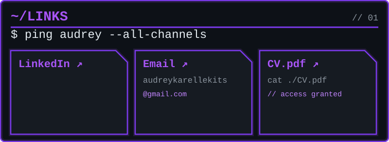
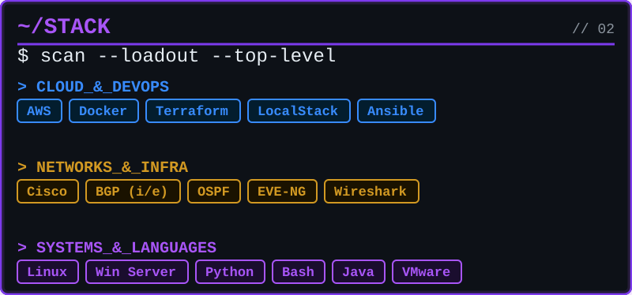
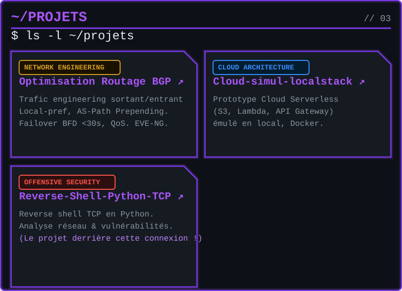

<a href="https://www.linkedin.com/in/audreykarellekitio/">LinkedIn</a>
&nbsp;·&nbsp;
<a href="mailto:audreykarellekits@gmail.com">Email</a>
&nbsp;·&nbsp;
<a href="./CV_Kitio_Audrey.pdf">CV.pdf</a>

  

 

  

<a href="https://github.com/NekoKits1/Optimisation-Routage-BGP-pour-peering-FAI-CDN">↗ BGP Peering</a>
&nbsp;·&nbsp;
<a href="https://github.com/NekoKits1/Cloud-simul-avec-localstack">↗ LocalStack</a>
&nbsp;·&nbsp;
<a href="https://github.com/NekoKits1/Reverse-Shell-Python-TCP">↗ Reverse Shell</a>

  

