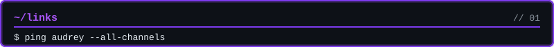
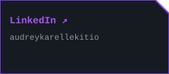
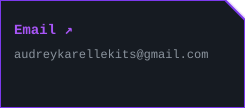
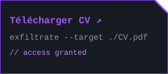
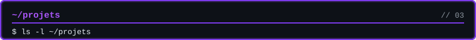
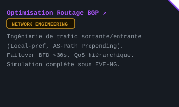
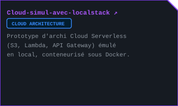
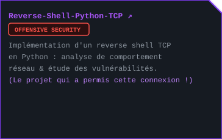

<table border="0" cellspacing="6" cellpadding="0"><tr>
<td></td>
<td></td>
<td></td>
</tr></table>

<table border="0" cellspacing="6" cellpadding="0"><tr>
<td></td>
<td></td>
</tr><tr>
<td></td>
<td></td>
</tr></table>

