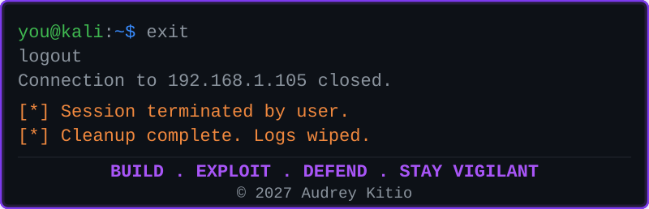

 

## `~$` à propos

Double-diplôme EFREI Paris × Institut Universitaire Saint Jean (Yaoundé), spécialisée réseaux, cloud et cybersécurité. En stage ingénieure réseau, j'ai fait tomber le temps de convergence BGP d'une architecture dual-upstream de **170 s à moins de 30 s**, et réduit le nombre de LSA OSPF **de 12 à 4 par routeur**. J'aime autant monter une archi que la casser pour comprendre où elle plie.

## `~$` projets

| Projet | Ce qu'il montre | Stack |
|---|---|---|
| **[Optimisation du routage BGP — peering FAI/CDN](https://github.com/NekoKits1/Optimisation-Routage-BGP-pour-peering-FAI-CDN)** | Architecture dual-upstream sous EVE-NG : failover 170 s → <30 s avec BFD, QoS hiérarchique, ingénierie de trafic (Local Preference, AS-Path Prepending) | `BGP` `OSPF` `EVE-NG` `Cisco IOS` |
| **[Reverse shell TCP en Python](https://github.com/NekoKits1/Reverse-Shell-Python-TCP)** | Implémentation offensive (C2, persistance via clé de registre) **et** sa détection : indicateurs réseau et système à surveiller côté défense | `Python` `sockets` `Blue Team` |
| **[Simulation cloud avec LocalStack](https://github.com/NekoKits1/Cloud-simul-avec-localstack)** | Pipeline serverless de traitement d'image conteneurisé, 4 services AWS orchestrés sans facturation réelle | `AWS` `Docker` `LocalStack` |

## `~$` compétences

**Réseaux & sécurité**
`BGP (iBGP/eBGP)` `OSPF multizone` `VRRP` `BFD` `VLAN` `NAT/DHCP/DNS` `MD5 auth`

**Cloud & DevOps**
`AWS (S3, Lambda, DynamoDB, API Gateway)` `LocalStack` `Docker` `Terraform`

**Systèmes & outils**
`Linux` `Windows Server (IIS)` `EVE-NG` `Git`

**Langages**
`Python` `Java`

## `~$` formation & communauté

- **EFREI Paris** — Cycle ingénieur, cybersécurité & cloud · 2026–2028
- **Institut Universitaire Saint Jean** — Diplôme d'ingénieur, sécurité des systèmes & communication · 2022–2026
- **AWS Student Builder Group (IUSJ)** — bureau / coordination, 50+ étudiants encadrés
- **AWS Community Day** — volontaire
- **Hult Prize (IUSJ)** — Deputy Campus Director, 5 équipes accompagnées

