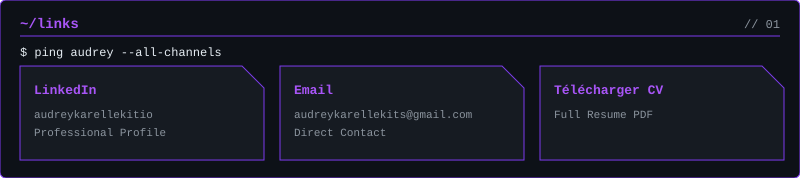
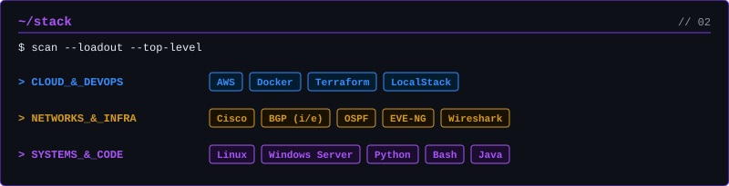
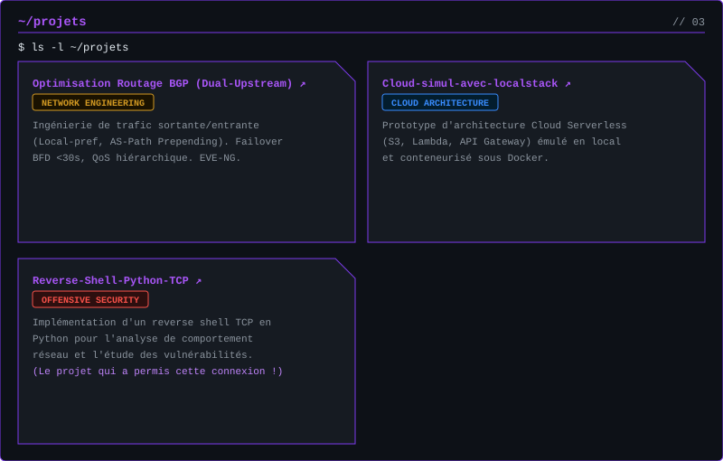

<a href="https://github.com/NekoKits1/Optimisation-Routage-BGP-pour-peering-FAI-CDN">↗ BGP Peering</a>
&nbsp;&nbsp;·&nbsp;&nbsp;
<a href="https://github.com/NekoKits1/Cloud-simul-avec-localstack">↗ LocalStack</a>
&nbsp;&nbsp;·&nbsp;&nbsp;
<a href="https://github.com/NekoKits1/Reverse-Shell-Python-TCP">↗ Reverse Shell</a>

